# 🔄 LOAN SYSTEM VISUAL FLOW CHART

## 📊 COMPLETE EXECUTION FLOW

```mermaid
graph TD
    A[Member Loan Request] --> B[LoanRequestForm.tsx]
    B --> C[POST /api/loans]
    C --> D{Validation}
    D -->|Success| E[Create Loan Record]
    D -->|Error| F[Return Error]
    E --> G[Status: PENDING]
    G --> H[Send to Admin Queue]
    
    H --> I[Admin Dashboard]
    I --> J[LoanRequests.tsx]
    J --> K[GET /api/loan-requests/pending]
    K --> L[Fetch Pending Loans]
    L --> M[Display in Table]
    
    M --> N{Admin Action}
    N -->|Approve| O[EnhancedLoanApproval.tsx]
    N -->|Reject| P[LoanRequestCard.tsx]
    
    O --> Q[POST /api/loan-requests/approve]
    Q --> R{80% Limit Check}
    R -->|Within Limit| S[Approve Loan]
    R -->|Exceeds Limit| T{Override?}
    T -->|Yes| S
    T -->|No| U[Show Error]
    
    S --> V[Update Loan Status]
    V --> W[Create Passbook Entry]
    W --> X[Send Notification]
    X --> Y[Status: APPROVED]
    
    P --> Z[POST /api/loan-requests/reject]
    Z --> AA[Update Loan Status]
    AA --> AB[Create Passbook Entry]
    AB --> AC[Send Notification]
    AC --> AD[Status: REJECTED]
    
    Y --> AE[Active Loans List]
    AD --> AE
    AE --> AF[SimplifiedAllLoans.tsx]
    AF --> AG[GET /api/loans]
    AG --> AH[Display Active Loans]
    
    AH --> AI[Member View]
    AI --> AJ[MemberLoanStatus.tsx]
    AJ --> AK[GET /api/member/loan-status]
    AK --> AL[Display Loan Details]
    
    AL --> AM{EMI Payment}
    AM -->|Pay EMI| AN[LoanPayment.tsx]
    AN --> AO[POST /api/loan-payment]
    AO --> AP[Create Payment Record]
    AP --> AQ[Update Loan Balance]
    AQ --> AR[Create Passbook Entry]
    AR --> AS[Update Status]
    
    AS --> AT{Loan Complete?}
    AT -->|Yes| AU[POST /api/loans/close]
    AT -->|No| AM
    AU --> AV[Status: CLOSED]
    AV --> AW[Create Final Entry]
    AW --> AX[Send Closure Notification]
```



## 🔗 API ENDPOINTS MAPPING

### 📤 MEMBER SIDE APIS
```
1. POST /api/loans
   └── LoanRequestForm.tsx
   └── Creates new loan request

2. GET /api/member/loan-status  
   └── MemberLoanStatus.tsx
   └── Gets member's loan details

3. POST /api/loan-payment
   └── LoanPayment.tsx
   └── Processes EMI payment
```

### 📡 ADMIN SIDE APIS
```
1. GET /api/client/loan-requests/pending
   └── LoanRequests.tsx
   └── Gets pending loan requests

2. POST /api/client/loan-requests/approve
   └── EnhancedLoanApproval.tsx
   └── Approves loan request

3. POST /api/client/loan-requests/reject
   └── LoanRequestCard.tsx
   └── Rejects loan request

4. GET /api/client/loans
   └── SimplifiedAllLoans.tsx
   └── Gets all active loans

5. POST /api/client/loans/close
   └── LoanActions.tsx
   └── Closes completed loan
```

## 🗄️ DATABASE OPERATIONS FLOW

### 📊 TABLES INVOLVED
```
1. Loan
   ├── Main loan records
   ├── Status tracking
   └── Financial calculations

2. PassbookEntry
   ├── Transaction history
   ├── Notifications
   └── Balance updates

3. LoanPayment
   ├── EMI records
   ├── Payment history
   └── Balance tracking

4. Member
   ├── Member details
   ├── Credit history
   └── Contact information

5. Notification
   ├── System notifications
   ├── Member alerts
   └── Reminders
```

### 🔄 DATA FLOW PATTERNS
```
Loan Request Flow:
   Member → Loan (PENDING) → PassbookEntry (REQUEST) → Notification (PENDING)

Loan Approval Flow:
   Admin → Loan (APPROVED) → PassbookEntry (APPROVED) → Notification (APPROVED)

Loan Rejection Flow:
   Admin → Loan (REJECTED) → PassbookEntry (REJECTED) → Notification (REJECTED)

EMI Payment Flow:
   Member → LoanPayment → PassbookEntry (PAYMENT) → Loan (BALANCE_UPDATE)

Loan Closure Flow:
   Admin → Loan (CLOSED) → PassbookEntry (CLOSED) → Notification (CLOSED)
```

## 🚨 CRITICAL ISSUE POINTS

### 1️⃣ END DATE CALCULATION ERROR
```
Current Logic: Date.now() + duration
Problem: Uses current date instead of approval date
Impact: Wrong loan schedule and EMI dates
Fix: Use approvalDate + duration
```

### 2️⃣ 80% LIMIT VALIDATION
```
Current Logic: Inconsistent across APIs
Problem: Different calculation methods
Impact: Security risk and inconsistent decisions
Fix: Create utility function for standardization
```

### 3️⃣ PASSBOOK INTEGRATION
```
Current Logic: Manual entry creation
Problem: Missing entries and duplicates
Impact: Incomplete transaction history
Fix: Automated entry with duplicate check
```

### 4️⃣ ERROR HANDLING
```
Current Logic: Basic try-catch
Problem: No transaction rollback
Impact: Data inconsistency
Fix: Database transactions with rollback
```

## 📈 PERFORMANCE OPTIMIZATION POINTS

### 🚀 HIGH PRIORITY
1. **Database Indexing**
   - Add indexes on loan status and member ID
   - Optimize query performance

2. **Caching Strategy**
   - Cache member deposit calculations
   - Cache pending loan requests

3. **Batch Operations**
   - Batch passbook entries
   - Batch notifications

### 🔄 MEDIUM PRIORITY
1. **API Response Optimization**
   - Implement pagination
   - Reduce payload sizes

2. **Background Jobs**
   - EMI reminders
   - Loan status updates

## 🔐 SECURITY CONSIDERATIONS

### 🛡️ VALIDATION POINTS
1. **Input Validation**
   - Amount limits
   - Duration constraints
   - Member eligibility

2. **Authorization**
   - Role-based access
   - Permission checks

3. **Audit Trail**
   - Action logging
   - Change tracking

---

*Flow Chart Version: v1.0*
*Last Updated: $(date)*